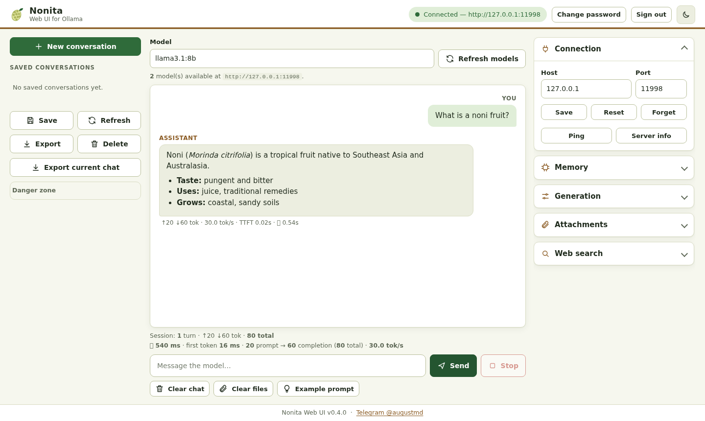
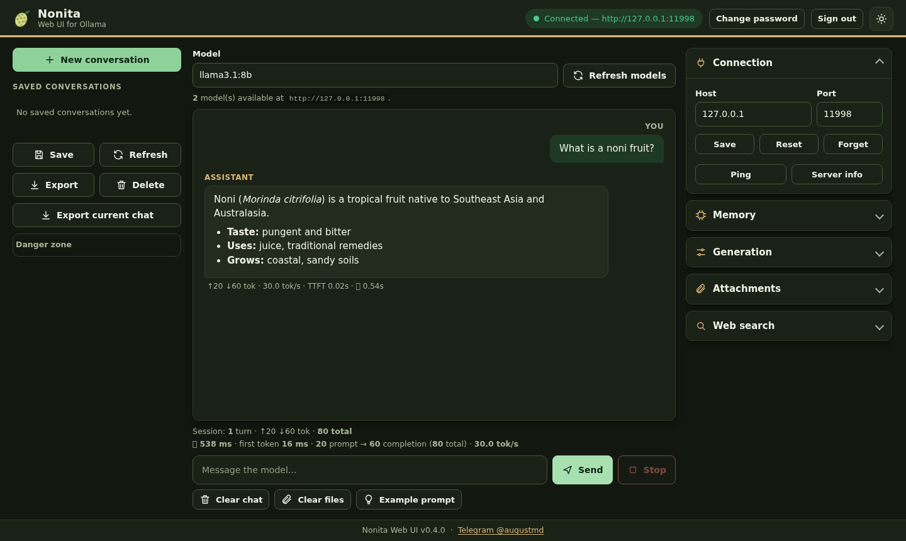
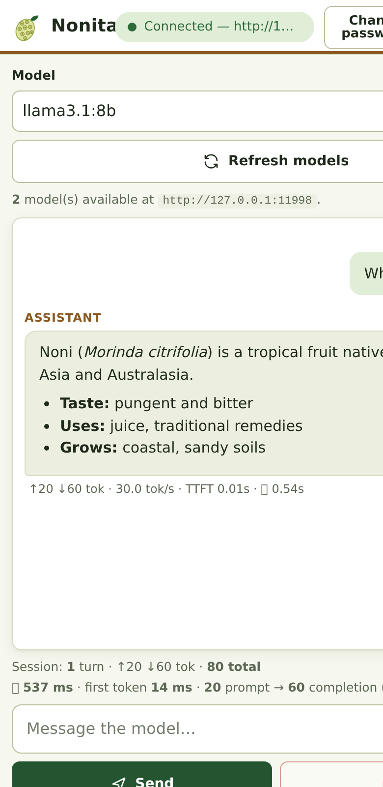
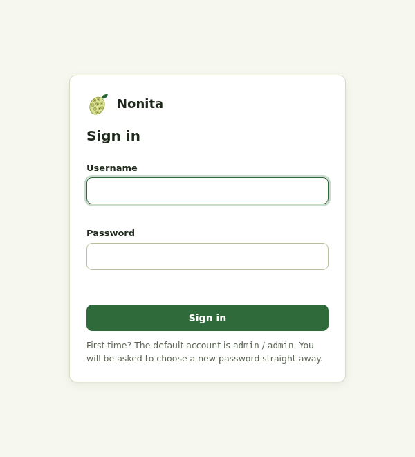
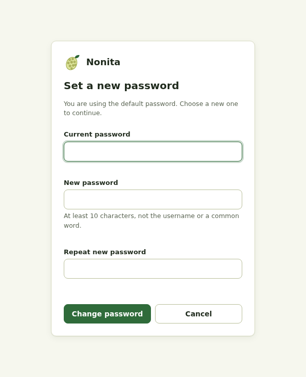

# Nonita

A small, self-hosted web UI for chatting with models on an [Ollama](https://ollama.com) server. FastAPI backend, plain HTML/JS frontend, no build step. Named after the noni fruit (*Morinda citrifolia*). **Built with privacy as the starting point:** no telemetry, analytics, CDNs or third-party scripts, and your chats go only where you point them.



<p>
  
  
</p>

## Features

- Sign-in with local accounts; the default `admin` / `admin` must be changed on first login
- Streaming chat with any model pulled on your Ollama host, with a Stop button
- Thinking-mode control for models that support it
- Saved conversations (local SQLite), export to text / file
- Attachments: text files and PDFs (per-file size limit)
- Optional DuckDuckGo web search; the reply shows how many results were used
- Token / speed metrics, model and server info, loaded-model memory view
- Light and dark themes, responsive layout, keyboard and screen-reader friendly
- HTTPS only, TLS 1.3 only, elliptic-curve certificates only (ECDSA P-384), security headers

## Privacy by design

Nonita is built around keeping your conversations under your control:

- **No telemetry, analytics, tracking or external scripts.** All JavaScript and libraries are served locally, and the Content-Security-Policy only allows connections back to Nonita itself.
- **Local by default:** Ollama and the UI both default to `127.0.0.1`; your server addresses live in a git-ignored `.env`.
- **Nothing is stored unless you ask:** chats are saved only when you press Save (encrypted with AES-256-GCM into an owner-only `nonita_history.db`); attachments are stored owner-only and deleted from disk right after the message that used them (or when you press Clear files); the browser keeps only host/port and theme, never prompts or passwords.
- **Real deletion:** Delete and Wipe follow NIST SP 800-88 Rev.1 (see below).
- **Protected accounts:** scrypt-hashed passwords, HttpOnly/SameSite=Strict cookies, owner-only auth database, HTTPS-only with TLS 1.3 and elliptic-curve certificates.
- **Web search is opt-in and off by default**, and results are never saved or exported.

Privacy still depends on how you configure it. Chats and attachments go to whichever Ollama host you set, and enabling web search sends your **whole message** to DuckDuckGo. If a search comes back empty, the query is saved with that conversation (so Delete/Wipe erase it) and is never written to the log. See the full source-level review in [`docs/privacy.md`](docs/privacy.md).

## Requirements

- Python 3.11+ and [uv](https://docs.astral.sh/uv/)
- A reachable Ollama server (local or remote)

## Quick start

```bash
git clone https://github.com/moralesaugusto/nonita.git
cd nonita
cp .env.example .env          # then edit OLLAMA_HOST etc.
uv run nonita                 # first start creates a self-signed EC certificate
```

Open `https://localhost:7860/` (HTTPS only; browsers warn about the self-signed certificate until you trust it). Plain `http://` is not served at all.

### First login



1. Sign in with **`admin`** / **`admin`**.
2. You are immediately required to choose a new password (no length, complexity or "must differ" rules; it just can't be empty). Nothing else works until you do.
3. Later, use **Change password** in the top bar. Changing a password signs out all other sessions.



Forgot the password? On the machine running Nonita: `uv run nonita reset-password` resets `admin` to `admin` (and forces a change again).

## Configuration

Everything lives in `.env` (copy [`.env.example`](.env.example)); real environment variables override it. `.env` is git-ignored, so your server's IP and ports stay private.

| Variable | Default | Meaning |
|---|---|---|
| `OLLAMA_HOST` | `127.0.0.1` | Hostname/IP or full `http(s)://` URL of Ollama |
| `OLLAMA_PORT` | `11434` | Port 1–65535 (ignored if host is a full URL) |
| `OLLAMA_TIMEOUT` | `120` | Request timeout, seconds |
| `NONITA_HOST` | `127.0.0.1` | Address the UI binds to. `0.0.0.0` exposes it to your whole network |
| `NONITA_PORT` | `7860` | UI port |
| `NONITA_MAX_UPLOAD_MB` | `20` | Per-file attachment size limit |
| `NONITA_DEBUG` | off | Show the debug panel by default |
| `NONITA_CERT` / `NONITA_KEY` | `cert.pem` / `key.pem` | HTTPS certificate and key paths |

Host and port can also be changed in the Connection panel and saved per browser (stored in that browser's `localStorage` only).

### HTTPS only, TLS 1.3, elliptic curve only

The web UI is served **only over HTTPS with TLS 1.3**. There is no HTTP mode, no TLS 1.2 or older, and session cookies are always `Secure` with HSTS. (The connection from Nonita to **Ollama** is unchanged: it uses whatever scheme you configure in `OLLAMA_HOST`.)

- On first start, if no certificate exists, Nonita creates a self-signed **ECDSA P-384 / SHA-384** pair (`cert.pem`, `key.pem` mode 600, valid 365 days, names: localhost, this machine's hostname, 127.0.0.1, ::1).
- To add the names/IPs you will browse to, regenerate it:

```bash
uv run nonita gen-cert --force --san nonita.lan --san 192.168.1.50
```

- **RSA keys are refused at startup.** You can supply your own certificate (`NONITA_CERT` / `NONITA_KEY`, for example from a private CA), but its key must be elliptic-curve. If only one of the two files exists, Nonita refuses to start.
- TLS 1.3 cipher suites are all AEAD with forward secrecy.

## Secure deletion (NIST SP 800-88 Rev.1)

**Delete** and **Wipe history database** sanitise data following [NIST SP 800-88 Rev.1](https://csrc.nist.gov/pubs/sp/800/88/r1/final):

- **Purge by cryptographic erase.** Saved conversations (titles and messages, including any saved search query) are encrypted with AES-256-GCM. The key lives in a separate owner-only file, `nonita_history.key`. *Wipe* shreds the database and the key. *Delete* rebuilds the database without that conversation under a **new key** and shreds the old database and old key. Anything left behind on the disk (SSD remnants, journals, copy-on-write blocks) is ciphertext whose key no longer exists.
- **Clear by overwrite.** Files are overwritten in place (default one pass, verified, `fsync`ed; raise it with `NONITA_SHRED_PASSES`), then renamed, truncated and unlinked. This also applies to attachments after the message that used them, and to exported `.txt` temp files.
- `PRAGMA secure_delete` is on and the SQLite journal is not left in WAL mode.

What this cannot do: erase **backups, snapshots, swap, or copies you made yourself**, or guarantee anything about a compromised host. Back up `nonita_history.db` and `.key` together, but remember that each backup keeps deleted conversations until you delete it too. For stronger guarantees on a laptop or server, use full-disk encryption (LUKS, FileVault, BitLocker). If `nonita_history.key` is lost, saved conversations are unreadable by design. Existing plaintext databases from earlier versions are encrypted automatically on first use and the plaintext file is shredded.

## Security model

- All `/api/*` routes require a login session (HttpOnly, `SameSite=Strict`, `Secure` over HTTPS cookie, 12 h lifetime). Cross-origin POSTs are rejected. Everything travels over TLS 1.3, so passwords are never sent in clear text.
- Passwords are stored as salted scrypt hashes in `nonita_auth.db` (git-ignored, mode 600). Five failed logins lock that user and client for 60 s.
- A fresh install always has the well-known `admin`/`admin` account until its first login changes it, so **do not expose a new install to an untrusted network before you have signed in once.** The default bind address is `127.0.0.1` for this reason.

## Limitations

- One account (`admin`) and one shared history database (`nonita_history.db`): everyone who signs in sees all saved conversations. There is no user management UI beyond changing the password, and no 2FA.
- Login throttling is in memory and per process; sessions persist across restarts.
- Self-signed certificates produce a browser warning until you trust the certificate, and clients that only speak TLS 1.2 or older cannot connect.
- Attachments are limited to text and PDFs; scanned PDFs are not OCR'd. Images are not supported.
- Web search uses the unofficial DuckDuckGo scraper (`ddgs`) and can be rate-limited or fail; the UI tells you when it returns nothing.
- Only talks to Ollama's HTTP API (which itself has no auth; the connection from Nonita to Ollama is whatever scheme you configure).
- Context length and quality depend on the model and your Ollama settings.
- Markdown rendering uses vendored `marked` and `DOMPurify`; no CDN access is needed.

## Development

```bash
uv run --extra dev pytest
```

Design notes: [`docs/decisions.md`](docs/decisions.md). Changes: [`docs/CHANGELOG.md`](docs/CHANGELOG.md).

## License

[MIT](LICENSE) © 2026 Augusto Morales. Contact: Telegram [@augustmd](https://t.me/augustmd).
